# AWS Systems Manager (SSM) Session Manager & Run Command Lab

## Project Overview

This project demonstrates how to securely manage Amazon EC2 instances without using SSH access or key pairs by leveraging AWS Systems Manager (SSM).

The infrastructure is provisioned using Terraform and includes an EC2 instance configured with an IAM Role and Instance Profile that allows communication with AWS Systems Manager.

The project focuses on designing, deploying, and managing cloud infrastructure using modern operational practices commonly adopted in enterprise environments.

---

# Project Workflow

* Design a secure EC2 management solution without SSH access.
* Deploy AWS infrastructure using Terraform.
* Configure IAM Roles and Instance Profiles for Systems Manager.
* Register EC2 instances as Managed Nodes.
* Connect to EC2 instances using Session Manager.
* Execute remote administrative tasks using Run Command.
* Install and manage software remotely without opening port 22.
* Demonstrate secure infrastructure management practices.

---

# Architecture Diagram

```text
                    +----------------------+
                    | AWS Systems Manager  |
                    |  Session Manager     |
                    |  Run Command         |
                    +----------+-----------+
                               |
                               |
                               v
                    +----------------------+
                    |      EC2 Instance    |
                    |    Ubuntu 24.04 LTS |
                    +----------+-----------+
                               |
                               |
                    +----------v-----------+
                    |      IAM Role        |
                    | AmazonSSMManaged     |
                    | InstanceCore Policy  |
                    +----------------------+
```

---

# Technologies & Tools Used

## Cloud Platform

* Amazon Web Services (AWS)

## Infrastructure as Code

* Terraform

## AWS Services

* Amazon EC2
* AWS Systems Manager (SSM)
* Session Manager
* Run Command
* IAM Roles
* IAM Instance Profiles
* Security Groups

## Operating System

* Ubuntu 24.04 LTS

## Software Installed

* Nginx

---

# Infrastructure Components

## EC2 Instance

* Ubuntu 24.04 LTS
* t2.micro
* Managed through AWS Systems Manager

## IAM Role

Attached policy:

```text
AmazonSSMManagedInstanceCore
```

Provides permissions required for:

* Session Manager
* Run Command
* Managed Node registration

## Security Group

Outbound:

```text
0.0.0.0/0
```

Inbound:

```text
No SSH (Port 22)
```

This project intentionally avoids SSH access.

---

# Deployment Workflow

## Step 1

Initialize Terraform

```bash
terraform init
```

## Step 2

Validate Configuration

```bash
terraform validate
```

## Step 3

Review Infrastructure Plan

```bash
terraform plan
```

## Step 4

Deploy Infrastructure

```bash
terraform apply
```

## Step 5

Verify Managed Node Registration

AWS Console:

```text
Systems Manager
→ Fleet Manager
→ Managed Nodes
```

## Step 6

Connect Using Session Manager

AWS Console:

```text
Systems Manager
→ Session Manager
→ Start Session
```

## Step 7

Execute Remote Commands

AWS Console:

```text
Systems Manager
→ Run Command
→ AWS-RunShellScript
```

---

# Operational Tasks Performed

## Verify System Information

```bash
hostname
whoami
uptime
```

## Check Disk Usage

```bash
df -h
```

## Check Memory Usage

```bash
free -m
```

## Verify Operating System

```bash
cat /etc/os-release
```

---

# Remote Software Installation

## Install Nginx

```bash
sudo apt update
sudo apt install nginx -y
```

## Start Nginx

```bash
sudo systemctl start nginx
```

## Enable Nginx

```bash
sudo systemctl enable nginx
```

## Verify Service Status

```bash
systemctl is-active nginx
```

Expected Output:

```text
active
```

## Verify Web Server

```bash
curl localhost
```

Expected Output:

```html
Welcome to nginx!
```

---

# Screenshots

## Terraform Deployment
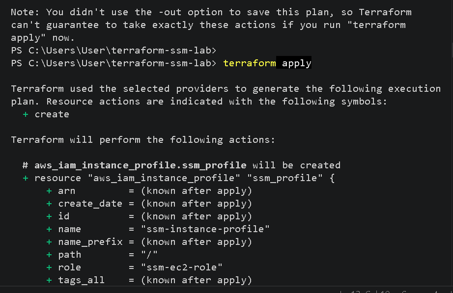

## Terraform Complete
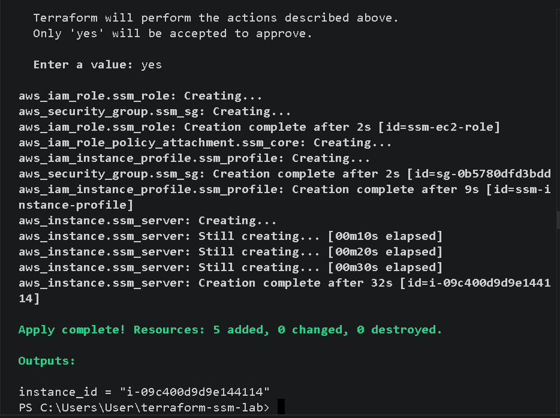

## Managed Node Registration Server and SSM Terminal
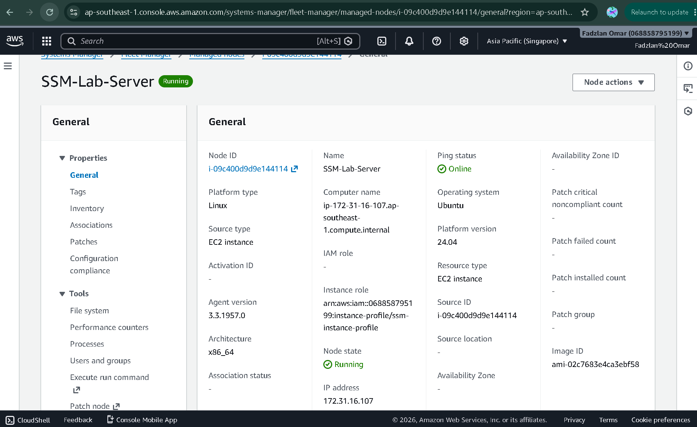
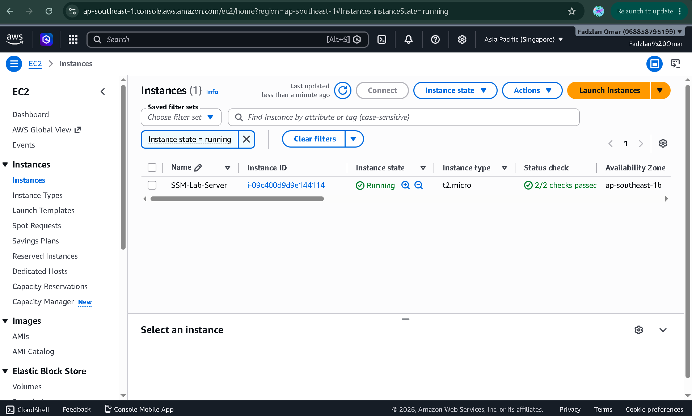
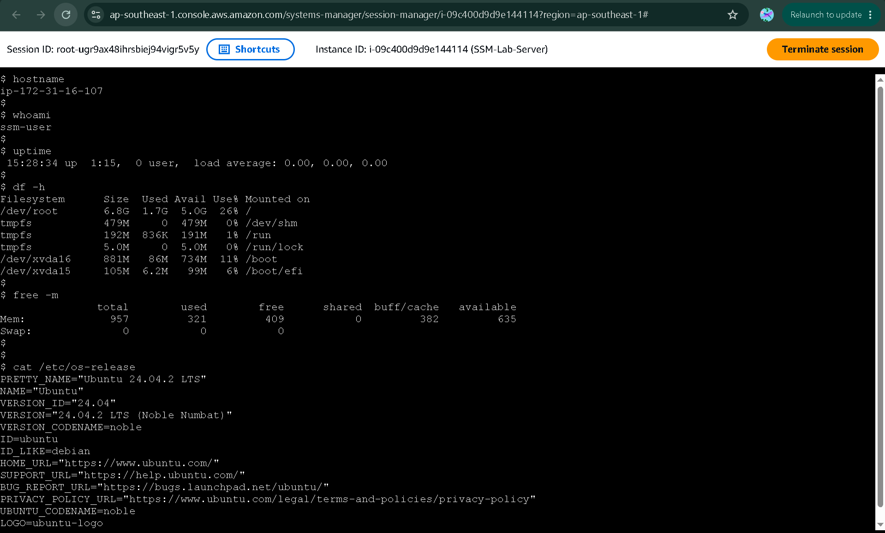

## Fleet Manager in Running Connection
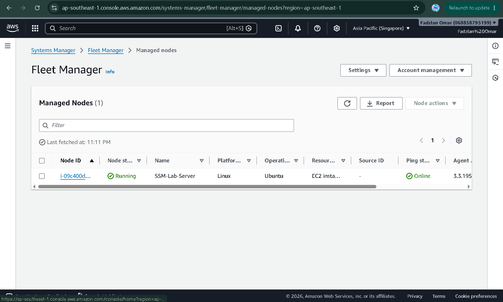

## Run Command Execution
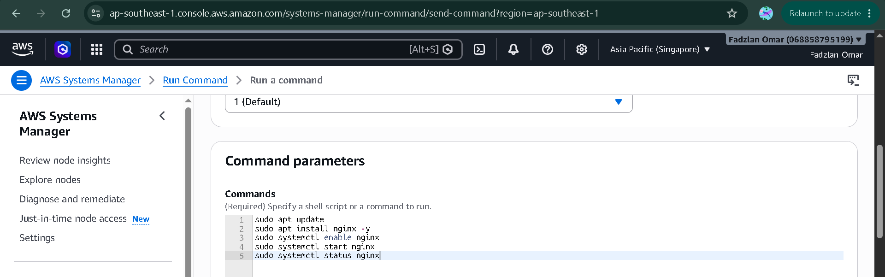
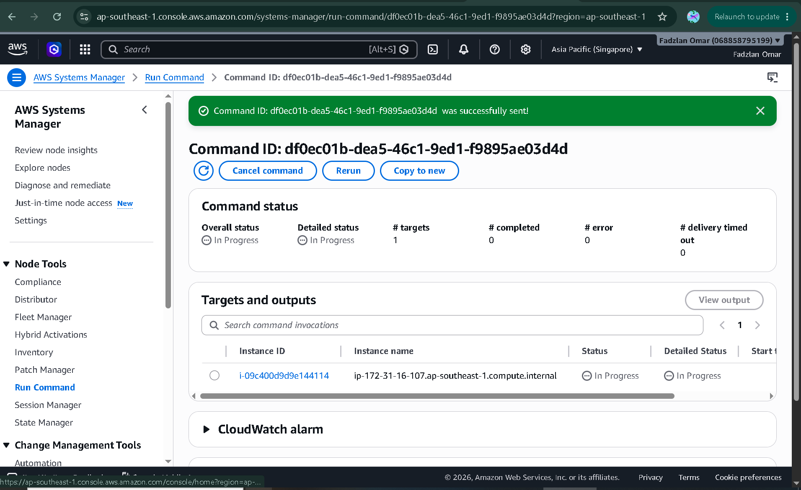
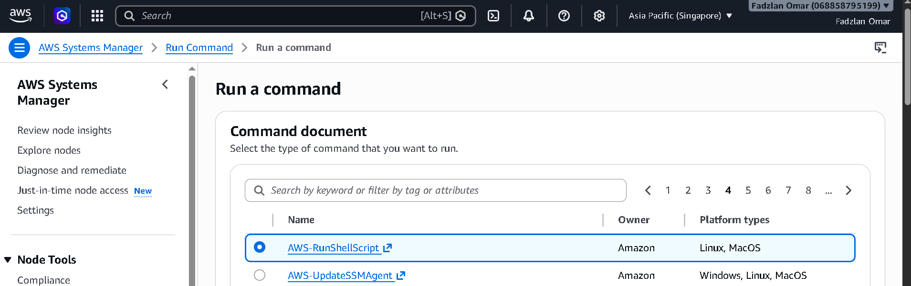

## Command Outputs
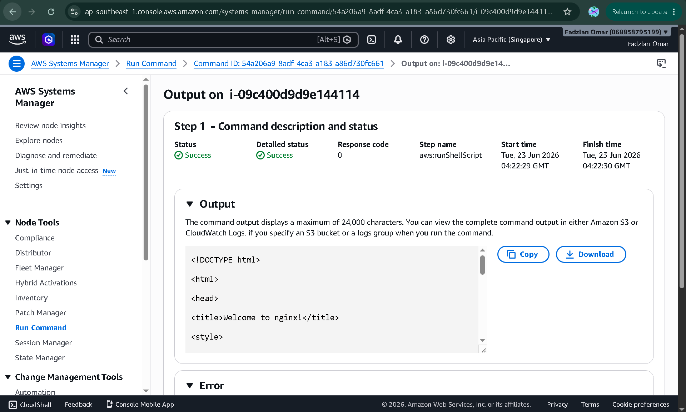
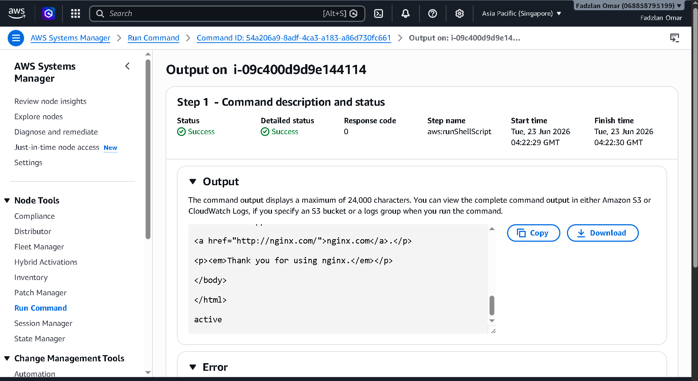

## EC2 Instance
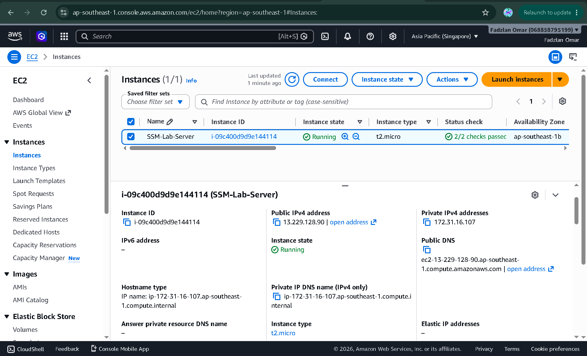

---

# Security Benefits of AWS Systems Manager

Traditional Administration:

```text
Administrator
    ↓
SSH
    ↓
EC2
```

Systems Manager Administration:

```text
Administrator
    ↓
AWS Systems Manager
    ↓
EC2
```

Advantages:

* No SSH access required
* No port 22 exposure
* No key pair management
* Centralized administration
* Auditability through AWS
* Improved security posture

---

# Key Cloud Engineering Concepts Demonstrated

## Design

* Secure remote administration architecture
* IAM-based access management
* Managed Node registration

## Deploy

* Infrastructure provisioning using Terraform
* IAM Role deployment
* EC2 deployment

## Manage

* Session Manager connectivity
* Run Command execution
* Software installation
* Service administration

## Operate

* Linux administration
* Package management
* Service monitoring
* Infrastructure verification

---

# What I Learned

Through this project, I learned how to:

* Provision AWS infrastructure using Terraform.
* Configure IAM Roles and Instance Profiles.
* Register EC2 instances as AWS Systems Manager Managed Nodes.
* Access EC2 instances without SSH.
* Use Session Manager for secure remote administration.
* Use Run Command to automate operational tasks.
* Install and manage software remotely.
* Verify Linux services using systemctl.
* Follow enterprise-grade security practices by eliminating SSH access.

---

# Cleanup

Destroy all provisioned resources:

```bash
terraform destroy
```

---

# Author

**Fadzlan Omar**

Cloud & Infrastructure Engineering Portfolio Project

AWS | Terraform | Systems Manager | Linux | Infrastructure as Code
